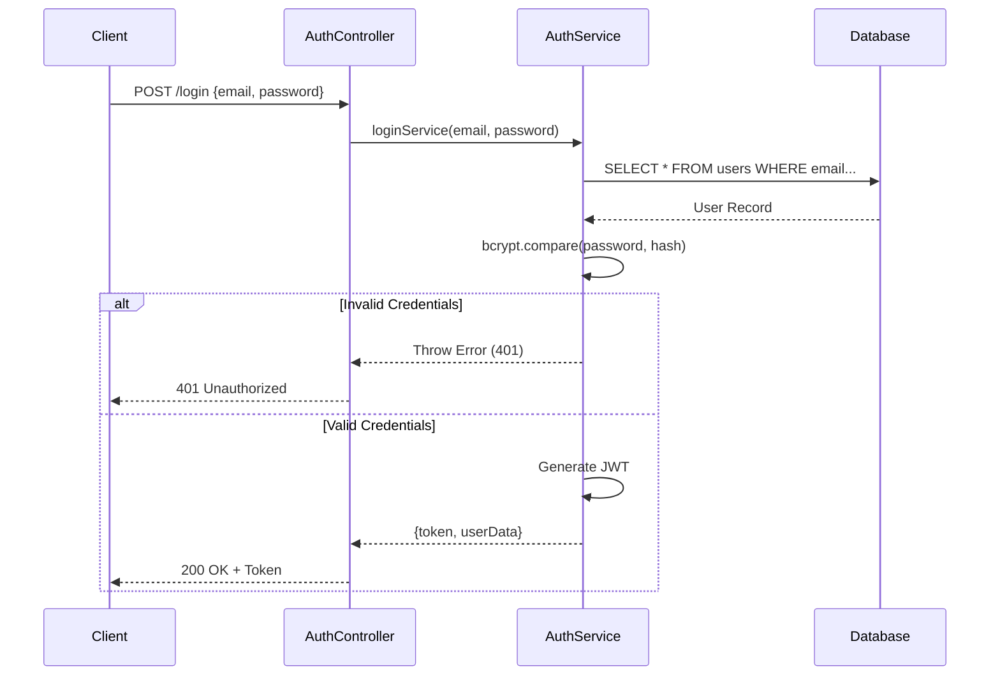
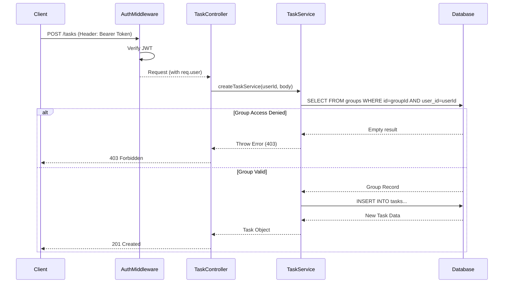
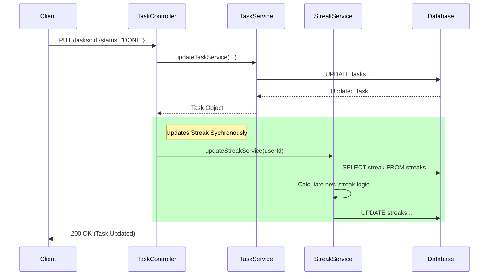

# Low Level Design (LLD): Attendance & To-Do Application Backend

## 1. Introduction
This document provides the low-level design for the backend of the Attendance & To-Do Application. It details the system architecture, database schema, component design, and data flow.

## 2. System Architecture
The application follows the **Model-View-Controller (MVC)** architectural pattern (specifically Controller-Service-Repository layers), built using **Node.js** and **Express**.

*   **Presentation Layer (Routes)**: Defines API endpoints and routes requests to the appropriate controllers.
*   **Controller Layer**: Handles incoming HTTP requests, validates input, and orchestrates calls to the service layer.
*   **Service Layer**: Contains the core business logic. It interacts with the database via the connection pool.
*   **Data Access Layer**: Direct database interactions using `pg` (node-postgres).
*   **Database**: PostgreSQL relational database.

## 3. Tech Stack
*   **Runtime**: Node.js
*   **Framework**: Express.js
*   **Database**: PostgreSQL
*   **Authentication**: JWT (JSON Web Tokens)
*   **Security**: bcrypt (Password hashing), cors (Cross-Origin Resource Sharing)

## 4. Database Design (Schema)

The database consists of the following key tables:

### 4.1. `users`
Stores user account information.
| Column | Type | Constraints | Description |
| :--- | :--- | :--- | :--- |
| `id` | SERIAL | PRIMARY KEY | Unique user identifier |
| `name` | VARCHAR(100) | NOT NULL | User's full name |
| `email` | VARCHAR(150) | UNIQUE, NOT NULL | User's email address |
| `password` | TEXT | NOT NULL | Hashed password |
| `created_at` | TIMESTAMP | DEFAULT CURRENT_TIMESTAMP | Account creation time |

### 4.2. `groups`
Represents user-created groups for organizing tasks.
| Column | Type | Constraints | Description |
| :--- | :--- | :--- | :--- |
| `id` | SERIAL | PRIMARY KEY | Unique group identifier |
| `user_id` | INT | FK -> users(id) | Owner of the group |
| `name` | VARCHAR(100) | NOT NULL | Group name |
| `description` | TEXT | | Optional description |
| `created_at` | TIMESTAMP | DEFAULT CURRENT_TIMESTAMP | Creation time |

### 4.3. `tasks`
Stores individual tasks associated with groups.
| Column | Type | Constraints | Description |
| :--- | :--- | :--- | :--- |
| `id` | SERIAL | PRIMARY KEY | Unique task identifier |
| `group_id` | INT | FK -> groups(id) | Parent group |
| `title` | TEXT | NOT NULL | Task title |
| `description` | TEXT | | Detailed description |
| `status` | VARCHAR | | Task status (TODO, DONE, etc.) |
| `priority` | VARCHAR | DEFAULT 'MEDIUM' | Task priority (LOW, MEDIUM, HIGH) |
| `progress` | INT | | Progress percentage (0-100) |
| `completed` | BOOLEAN | DEFAULT FALSE | Completion flag |
| `created_at` | TIMESTAMP | DEFAULT CURRENT_TIMESTAMP | Creation time |
| `updated_at` | TIMESTAMP | | Last update time |

### 4.4. `streaks` / `user_streaks`
Tracks user activity streaks.
*Note: `user_streaks` is initialized in default config, but `streaks` is used in service logic.*
| Column | Type | Constraints | Description |
| :--- | :--- | :--- | :--- |
| `user_id` | INT | FK -> users(id) | User identifier |
| `current_streak` | INT | | Current active streak count |
| `last_active_date` | DATE | | Date of last registered activity |

### 4.5. `comments`
Stores comments on tasks.
| Column | Type | Constraints | Description |
| :--- | :--- | :--- | :--- |
| `id` | SERIAL | PRIMARY KEY | Unique comment identifier |
| `task_id` | INT | FK -> tasks(id) | Parent task |
| `user_id` | INT | FK -> users(id) | Author of the comment |
| `comment` | TEXT | NOT NULL | Comment content |
| `created_at` | TIMESTAMP | DEFAULT CURRENT_TIMESTAMP | Creation time |

## 5. Component Design

### 5.1. Authentication Module
*   **Auth Controller**: 
    *   `registerController`: Hashes password, creates user.
    *   `loginController`: Verifies credentials, issues JWT.
*   **Auth Service**: 
    *   `registerService`: DB insertion logic.
    *   `loginService`: DB lookup and bcrypt comparison.

### 5.2. Task Management Module
*   **Task Controller**: 
    *   `createTask`: Calls service to add task.
    *   `updateTask`: Updates task details and triggers streak update.
    *   `deleteTask`: Removes task.
*   **Task Service**: 
    *   `createTaskService`: Validates group ownership, inserts task.
    *   `updateTaskService`: Syncs `status` <-> `progress`, updates DB.
    *   `deleteTaskService`: Removes task belonging to user's group.

### 5.3. Dashboard & Analytics Module
*   **Dashboard Controller**: 
    *   `getDashboard`: Aggregates stats.
    *   `getStreak`: Fetches streak info.
*   **Dashboard Service**: 
    *   `getDashboardService`: Complex SQL queries to fetch:
        *   Group counts
        *   Task completion stats
        *   Priority distribution
        *   Recent tasks
        *   Weekly activity graph values
*   **Streak Service**:
    *   `updateStreakService`: Logic to increment streak if active today vs yesterday.

## 6. Sequence Diagrams

### 6.1. User Login Flow

### 6.2. Create Task Flow

### 6.3. Task Completion & Streak Update

